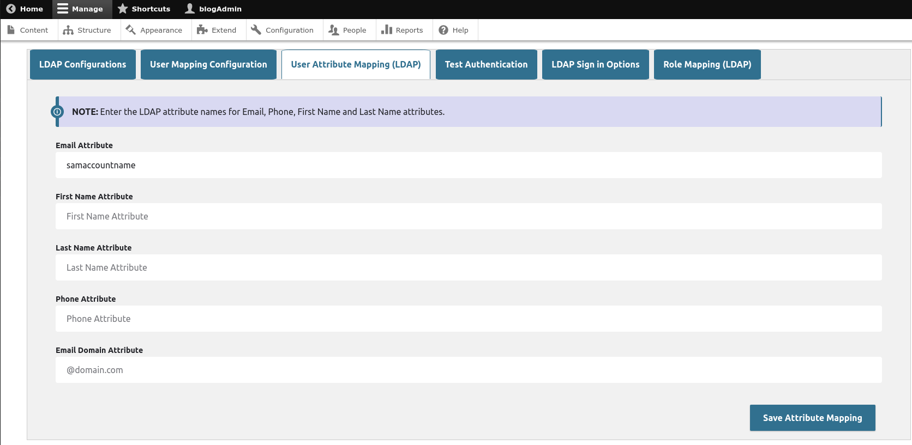

### Active Directory(LDAP) for Drupal
-------------------------------------

 * Introduction
 * Requirements
 * Installation
 * Configuration
 * Maintainers


INTRODUCTION
------------

The Active Directory(LDAP) for Drupal module provides configurable integration with active directory using the ldap php extension.

  

 * For the description of the module visit:
   https://www.drupal.org/project/drupal_ad


REQUIREMENTS
------------

This module requires the following php extensions.
  - **ldap** : Follow the link to set up ldap [setting up php-ldap](https://gist.github.com/ssiva13/16480feae02061ae90b9ac3a4718ba0d)
  - **openssl**

This module requires the following modules outside of Drupal core.
  - **field_group** : Use this command to install it ``` composer require drupal/field_group ```
  - **fontawesome** : Use this command to install it ``` composer require drupal/fontawesome ```
  - **jquery** : Use this command to install it ``` composer require drupal/jquery ```


INSTALLATION
------------
Install the Active Directory(LDAP) for Drupal module using composer.
```
composer require 'drupal/drupal_ad-drupal_ad:^1.2'
```
Visit [how to install modules](https://www.drupal.org/node/1897420) for further information.


CONFIGURATION
-------------
- Enabling the module via the administrator module or the cli.
   - Navigate to Administration > Extend and enable the module.
   - Enable using ``` drush en drupal_ad ```
- Navigate to Administration > Configuration > System > Active Directory for Drupal and configure the module.


MAINTAINERS
-----------
 * Simon Siva - [Drupal](https://www.drupal.org/u/ssiva)
 * Simon Siva - [Github](https://github.com/ssiva13)
